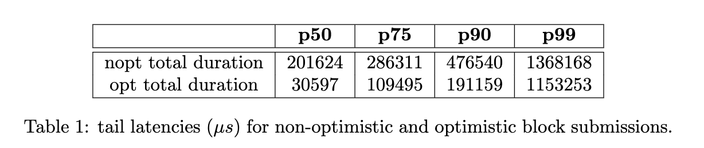
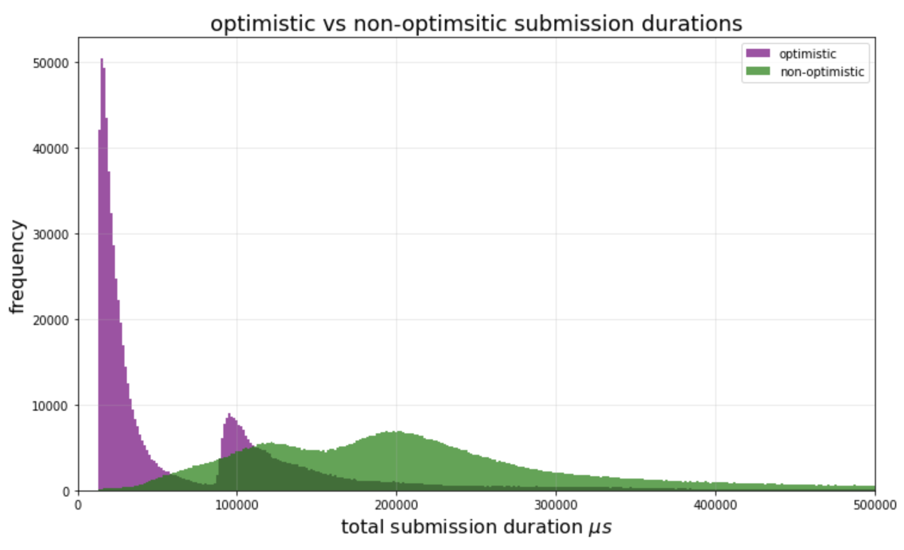
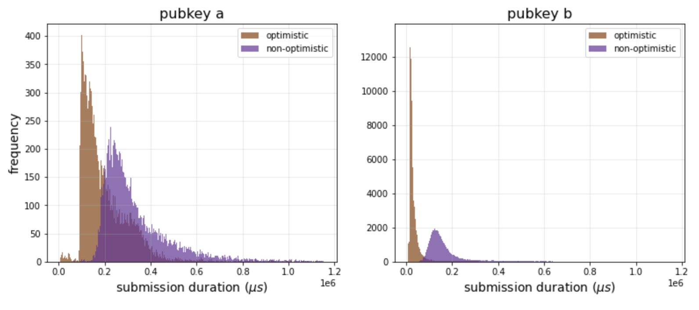
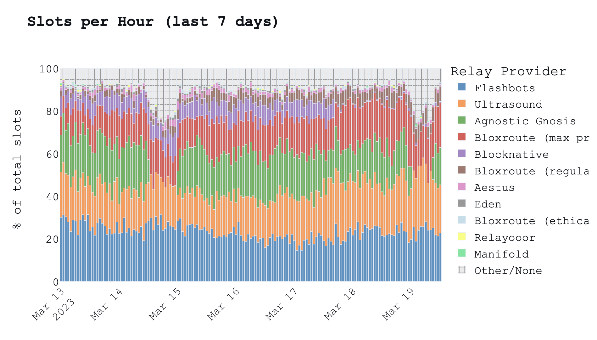
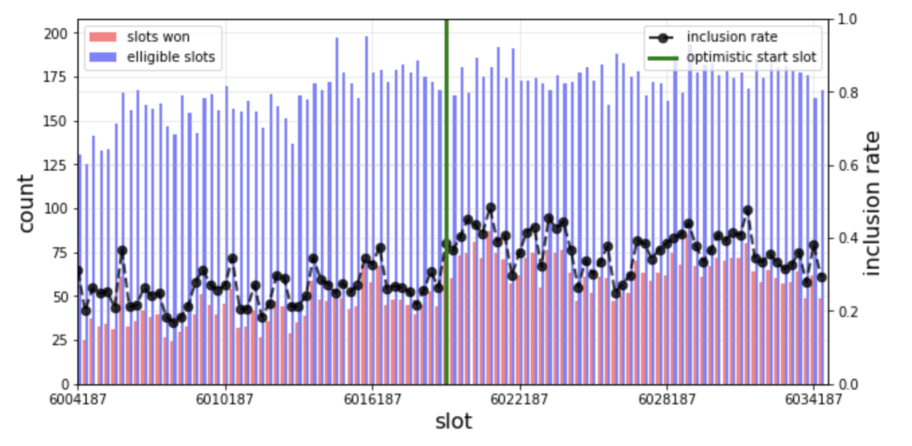

# An optimistic weekend – early data analysis
[@mikeneuder](https://twitter.com/mikeneuder) – March 19, 2023
### Purpose

On Friday March 17, 2023 at 12PM UTC, [the ultra sound relay](https://relay.ultrasound.money) began optimistic relaying. This document presents a first look at some of the data we collected this weekend and the initial impact of optimistic relaying.

### Related work
1. [*proposal*](https://github.com/michaelneuder/opt-relay-docs/blob/main/proposal.md) – the initial document outlining the rationale of optimistic relying.
2. [*implementation*](https://github.com/flashbots/mev-boost-relay/pull/285) – the PR that implements the optimistic logic on flashbots' relay implementation.
3. [*community call #0*](https://collective.flashbots.net/t/mev-boost-community-call-0-23-feb-2023/1348), [*community call #1*](https://collective.flashbots.net/t/mev-boost-community-call-1-9-mar-2023/1367) – the two MEV boost community calls, during which optmistic relaying was a topic of discussion.
4. [*roadmap*](https://github.com/michaelneuder/optimistic-relay-documentation/blob/main/towards-epbs.md) – a roadmap presenting the future plans for optimstic relaying in the context of enshrined PBS.
5. [*builder guide*]( https://github.com/ultrasoundmoney/mev-boost-relay/blob/prod-optimistic-relaying/docs/optimistic/builder-onboarding.md) – a document describing the process for builder onboarding to optimistic relaying.
6. [*event log*](https://github.com/ultrasoundmoney/mev-boost-relay/blob/prod-optimistic-relaying/docs/optimistic/event-log.md) – a log builders who have posted collateral and their respective pubkeys.

### Block submission durations
The purpose of optimistic relaying is to reduce the time it takes for a builder to submit a block. We define *total duration* of a submission as the number of microseconds ($\mu s$) between when the message is [received](https://github.com/ultrasoundmoney/mev-boost-relay/blob/a4fe413af1258025f456642305ef222fd5fae89c/services/api/service.go#L1241) and when the bid become [eligible](https://github.com/ultrasoundmoney/mev-boost-relay/blob/a4fe413af1258025f456642305ef222fd5fae89c/services/api/service.go#L1562) to win the auction. By removing block validation from the submission path, we see a dramatic reduction in the total duration.


Table 1 shows the tail latencies for simulation and total duration. Simulation duration is how long the relay spends waiting for the block simulation to complete. In optimistic mode, this is only a few microseconds because we just start a goroutine to do the block validation asynchronously. 
We can also compare the distributions of total durations.

It is clear that opimistic submissions are much faster than non-optimistic submissions. The bimodality of both distributions is due to differing locations of the builders. Broadly speaking, builders who run in Europe will have much faster submissions because the network latency will be so much lower when connecting to the ultra sound relay (which runs in Europe). Any builders running in a different geographical location will see longer submissions durations because the bottleneck is now the network latency. We demonstrate this by examining per-pubkey latencies.

This figure shows 2 different pubkeys (anonymized). Pubkey a is not in Europe, while Pubkey b is. This demonstates the massive impact on submission duration that continental collocation has. This disparity is much more pronounced in optimistic submissions because they shift the bottleneck to the network latency. Lasly, we examine the per-pubkey mean submission duration before and after optimistic relaying. 

This table shows that across the board, optimsitic submission total durations have at least a 1.5x improvement in the mean. Builders who are running in Europe see closer to a 3-4x improvement.

### Relay performance
Reducing the submission durations is great, but it only matters if it impacts the overall performance of the relay. The easiest metric to look at is the percentage of total slots that the ultra sound relay received the winning block. This data is from [Toni Wahrstätter's](https://twitter.com/nero_eth) excellent [mevboost.pics](mevboost.pics) page 

The clear increase beginning midday on March 17 is the result of optimistic relaying. Isolating our data, we see that our slots relayed per-hour increased by 23 on average.

Another interesting metric to measure is inclusion rate. We define *inclusion rate* as the percentage of slots that have a registered validator that the ultra sound relay wins. Isolating just the optimistic pubkeys, we see a 10% increase in inclusion rate since starting optimistic relaying.

The optimistic pubkeys average hourly inclusion rate jumped from 27% to 37% as a result of the change (i.e., the set of optimistic pubkeys have a 10% higher probability of winning the auction). Overall, we see that the reduction in simulation duration has directly corresponded to better relay performance for the builders. 

### Network health
We are happy to report that the launch has been incredible smooth from a network health perspective. There have been only 9 block simulation failures out of 4.2 million optimistic block submissions. The 9 failures were all the same error with request context being closed, which we are investigating.

```
        inserted_at         |  slot   | submit_block_sim_error 
----------------------------+---------+------------------------
 2023-03-18 02:39:49.259863 | 6023597 | request context closed
 2023-03-18 05:30:47.127693 | 6024452 | request context closed
 2023-03-18 10:22:24.260585 | 6025910 | request context closed
 2023-03-18 15:27:35.688103 | 6027436 | request context closed
 2023-03-18 17:21:51.857223 | 6028007 | request context closed
 2023-03-18 18:50:00.68639  | 6028448 | request context closed
 2023-03-19 02:28:03.99923  | 6030738 | request context closed
 2023-03-19 07:04:21.457901 | 6032120 | request context closed
 2023-03-19 15:01:11.395809 | 6034504 | request context closed
(9 rows)
```

Each slot that had a simulation error still had a block published either through our relay or another, so optimistic relaying has not caused any missed slots. We are working on onboarding more builders and will continue to simulate all optimitstic blocks to ensure we catch builder or relay bugs as early as possible!